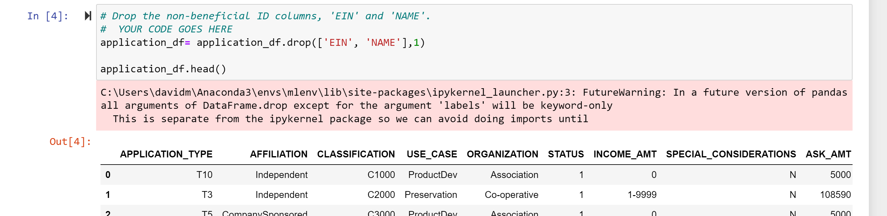
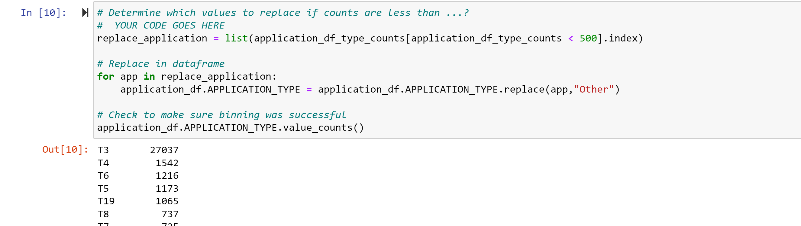
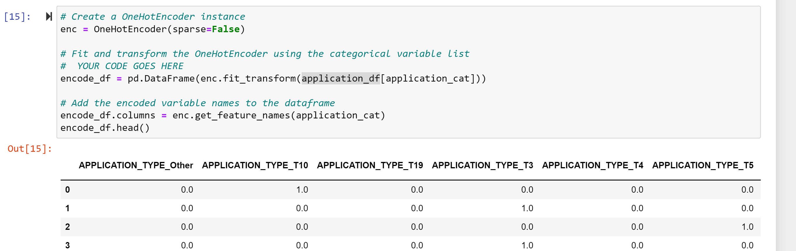
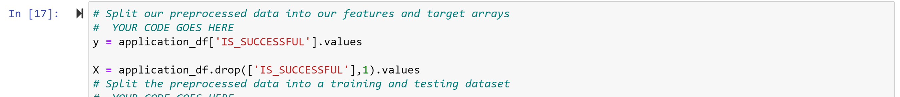
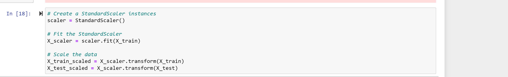
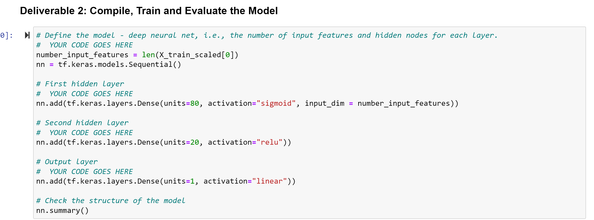
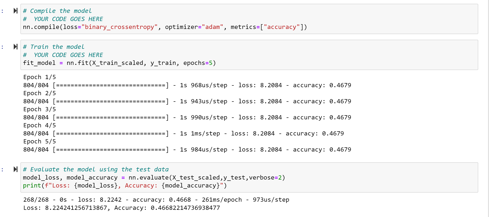

# Neural_Network_Charity_Analysis:  By David Matheny:  Date 4/23/2022

# Overview of the analysis:
Beks has come a long way since her first day at that boot camp five years ago—and since earlier this week, when she started learning about neural networks! Now, she is finally ready to put her skills to work to help the foundation predict where to make investments.

With your knowledge of machine learning and neural networks, you’ll use the features in the provided dataset to help Beks create a binary classifier that is capable of predicting whether applicants will be successful if funded by Alphabet Soup.

From Alphabet Soup’s business team, Beks received a CSV containing more than 34,000 organizations that have received funding from Alphabet Soup over the years,

# Results:

## Data Preprocessing
What variable(s) are considered the target(s) for your model? 
IS_SUCCESSFUL—Was the money used effectively

What variable(s) are considered to be the features for your model? 
APPLICATION_TYPE—Alphabet Soup application type
AFFILIATION—Affiliated sector of industry
CLASSIFICATION—Government organization classification
USE_CASE—Use case for funding
ORGANIZATION—Organization type
STATUS—Active status
INCOME_AMT—Income classification
SPECIAL_CONSIDERATIONS—Special consideration for application
ASK_AMT

What variable(s) are neither targets nor features, and should be removed from the input data? 
EIN and NAME—Identification columns

## Compiling, Training, and Evaluating the Model
How many neurons, layers, and activation functions did you select for your neural network model, and why?
6 Layers, neurons per layer were in order 100, 80, 60, 40, 10, 1.  I used a combination of 2 activation funtions relu and sigmoid.  Testing different combinations led me to this combo for best accuracy.

Were you able to achieve the target model performance?  No but very close 73%

What steps did you take to try and increase model performance?  Changing the bins, to have less variance in the variables.  Add more hidden layers(and more neurons per layer) and trying different activation fuctions, as well as more epochs.

# Summary:
## Deliverable 1 Requirements:
The EIN and NAME columns have been dropped (5 pt)

The columns with more than 10 unique values have been grouped together (5 pt)

The categorical variables have been encoded using one-hot encoding (5 pt)

The preprocessed data is split into features and target arrays (5 pt)

The preprocessed data is split into training and testing datasets (5 pt)

The numerical values have been standardized using the StandardScaler() module (5 pt)

## Deliverable 2 Requirements:
The number of layers, the number of neurons per layer, and activation function are defined (2.5 pt)
An output layer with an activation function is created (2.5 pt)

There is an output for the structure of the model (5 pt)
There is an output of the model’s loss and accuracy (5 pt)

The model's weights are saved every 5 epochs (2.5 pt)
The results are saved to an HDF5 file (2.5 pt)

Additional hidden layers are added (5 pt)
The activation function of hidden layers or output layers is changed for optimization (5 pt)

![Graph 13. Results](resources/Deliverable3f.png

## Over all summary:
I achieved an overall 73% accuracy.  I would probably get with someone who is domain expert to see if there is more data or possibly a few features that we could take out.  I would also try using bins on all the categorical features.  I would also try using the Keras Functional model instead of the sequential to see if I get diff results.
